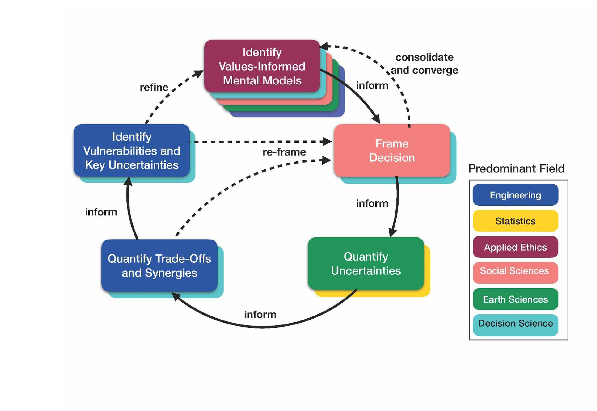

# F21: Water Systems Analysis

* James Doss-Gollin
* Rice University Civil and Environmental Engineering
* Draft Syllabus for Fall 2021
* Feedback welcome
* Possible alternate name: design and management of infrastructure systems

This course will provide an introduction to quantitative and qualitative frameworks for integrating scientific understanding into management of complex human-natural systems. Through the framing of a case study to be determined exploring a water challenge in the Houston / South Texas region, we will work through a comprehensive decision support process. Students will learn tools and methods individually, which they will contribute to a collective analysis.

1. **Define the problem:** The way a problem is defined frames and often defines the solution. What is the specific problem that you define? How does this fit into broader but less specific societal problems? Whose voice contributed to this problem definition?
    * What metrics are used to evaluate solutions?
    * What levers / possible solutions do you consider consider?
1. **Define relationships:** We don't have perfect models, so we must figure out how to use idealized representations of the natural and human systems of interest to generate actionable insight.
    * How does the scientific literature frame these relationships?
    * How do we assess whether a given model is fit for purpose?
    * What are uncertainties within and between models?
1. **Optimize decisions, quantify tradeoffs:** Conditional on a set of objetives, a set of decisions to consider, and a representation of the system, it is conceptually possible (though not necessarily straightforward) to identify a set of optimal decisions.
    * How do you validate the results of your optimization?
    * How do different decisions trade off different metrics of success?
1. **Learn and assess:** The purpose of modeling a system and optimizing decisions is to bring quantitative insight to the conversation surrounding a decision.
    * Are results credible?
    * Does the analysis need to consider different metrics or levers?
    * What are they key vulnerabilities of the system? I.e., under what conditions and decisions does the system perform unacceptably? Are these consistent with prior belief?
1. **Path to implementation:** How will you implement your solutions and measure their performance? What actions and data will you need? Over what time periods? Who will do what? How will they be funded?

As shown in the following figure (Keller, Srikrishnan, and Helgeson, _in prep._), this is necessarily an iterative process:

## Topics and organization

This will eventually morph into:

* a schedule
* readings, drawn widely (no single textbooks)
* a set of learning objectives tied specifically to specified assignments (see Grading)

### Background skills

* Programming git, GitHub, scripting (Python / Julia), command line
* Writing -- Markdown, Jupyter notebooks, LaTeX

### Defining problems

* ethics and values
* historical context
* how water systems work
* soliciting and synthesizing mental models
* stakeholder engagement
* systems thinking / diagrams
* trans/inter/multidisciplinary work

### Modeling relationships

* exploratory modeling
* hierarchy of models
* model selection / combination
* stationarity / nonstationarity
* survey of General Circulation Models, Hydrological models, Hydraulic models
* parametric uncertainty / deep uncertainty / total ignorance
* posterior predictive checks and model validation
* stochastic / probabilistic modeling
* weather / streamflow generators

### Optimize decisions

* linear programming
* dynamic programming
* black box optimization
* multiobjective evolutionary programming

### Assess limitations

* machine learning for vulnerability detection
* definitions of robustness
* more stakeholder engagement
* global sensitivity analysis

### Path to implementation

* as time permits
* I suspect Jim Blackburn has some recommended material here

## Brainstorm of possible case studies

* could dive into the controversy around coastal spine and alternatives
* Houston drinking water

## Grading

I'm interested in using specifications grading. Nilson (2015, p.128) provides a summary of the features of specifications grading:

* Students are graded pass/fail on individual assignments and tests or on bundles or modules of assignments and tests.
* Instructors provide very clear, detailed specifications (specs) -- even models if necessary -- for what constitutes a passing (acceptable/ satisfactory) piece of work. Specs reflect that the student has mastered a concept or idea.
* Students are allowed at least one opportunity to revise an unacceptable piece of work, or start the course with a limited number of tokens that they can exchange to revise or drop unacceptable work or to submit work late.
* Bundles and modules that earn higher course grades require students to demonstrate mastery of more skills and content, more advanced/ complex skills and content, or both.
* Bundles and modules are tied to the learning outcomes of the course or the program. Students will not necessarily achieve all the possible outcomes, but their course grade will indicate which ones they have and have not achieved.

For further discussion, see the following resources:

* [MA 425: Real Analysis syllabus – Andrew A Cooper](https://andrewacooper.wordpress.ncsu.edu/teaching/ma-425-syllabus/)
* [Return to specs grading: Calculus — Robert Talbert, Ph.D.](http://rtalbert.org/return-to-specs-grading-calculus/)
* [Specifications grading](https://ii.library.jhu.edu/2018/04/11/what-is-specifications-grading-and-why-should-you-consider-using-it/) 
* [Standards Based Specifications Grading in a Hybrid Course](https://peer.asee.org/standards-based-specifications-grading-in-a-hybrid-course)

I still need to map this onto my course. It can be effective when done well, but done poorly it can lead to communication. I'll engage with the [Rice Center for Teaching Excellence](https://cte.rice.edu/). I am fairly confident that it can work for the "tools and methods" part of the course but I need to think about how contributions to the group activity should contribute to the grade.

## Useful resources

* [A Few More Tips for Zoom Teaching - Teach Better](https://teachbetter.co/blog/2020/04/17/more-zoom-teaching/)
* [CEE 662 Water Resource Systems Analysis UMass - Brown](http://mie.umass.edu/sites/default/files/cee/fishpassage/CEE_662.pdf)
* [CEE 6660 Cornell - Reed](https://classes.cornell.edu/browse/roster/SP19/class/CEE/6660)
* [Doomed to Drown? Infrastructure Governance and Environmental Justice in Bangladesh | SESYNC](https://www.sesync.org/doomed-to-drown-infrastructure-governance-and-environmental-justice-in-bangladesh)
* [How I taught Flooding online in Spring 2020, Anne Jefferson](http://all-geo.org/highlyallochthonous/2020/05/how-i-taught-flooding-when-watershed-hydrology-went-online/)
* [My First Week Teaching a Big Zoom Class - Teach Better](https://teachbetter.co/blog/2020/04/13/big-zoom-classes/)
* [Social-Hydrological Risk in the Mexico City Basin (2015-9) | SESYNC](https://www.sesync.org/social-hydrological-risk-in-the-mexico-city-basin-2015-9)
* [Watershed Hydrology – Complete Compendium of my Online Teaching Resources | Highly Allochthonous](http://all-geo.org/highlyallochthonous/2020/05/watershed-hydrology-complete-compendium-of-my-online-teaching-resources/)
* [List of teaching resources](https://docs.google.com/document/d/1I7CASgLADZNCkTbsmH8Lqtifl3UQSwzL-j_1pMdZagE/edit)